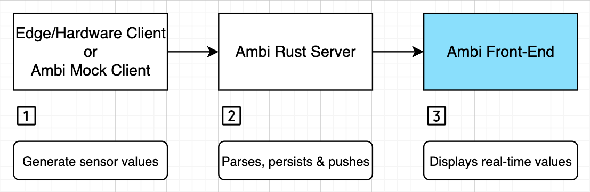

This is the frontend application supporting the [Ambi Rust](https://github.com/Jim-Hodapp-Coaching/ambi-rs) project. It provides a unified dashboard for ambient sensor data.


## Quickstart

To view a functional dashboard, start the mock-client and server and then;

Simply run:

```bash
npm i && npm run dev
```

Open [http://localhost:3000](http://localhost:3000) with your browser to see the result.

## Running the Ambi Mock Client to generate fake sensor values
Clone the Ambi Mock Client repo and [follow these instructions](https://github.com/Jim-Hodapp-Coaching/ambi_mock_client#usage-1)
## Running the Server
Clone the Ambi Server repo and [follow these instructions](https://github.com/Jim-Hodapp-Coaching/ambi-rs#non-container-setup)